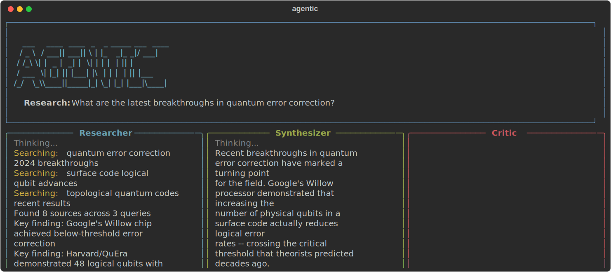

# agentic

Multi-agent AI research system.

A CLI tool where multiple AI agents -- Researcher, Synthesizer, Critic -- collaborate in real-time to answer complex research questions. Watch them think, search, and debate in a live terminal UI.



## Features

- Multi-agent orchestration with distinct roles (Researcher, Synthesizer, Critic)
- Real-time streaming terminal UI built with Rich
- Web search integration via Tavily
- Configurable research depth and iteration count
- Markdown and JSON export for research results

## Tech Stack

- Python 3.12+
- Anthropic SDK (Claude) for agent reasoning
- Rich for terminal rendering
- Typer for CLI interface
- httpx for async HTTP
- asyncio for concurrent agent execution

## Installation

```bash
git clone https://github.com/kokinedo/agentic.git
cd agentic
uv sync
```

## Authentication

agentic supports multiple AI providers. Use the built-in login flow to authenticate:

```bash
agentic login                       # default: Claude
agentic login --provider openai     # OpenAI
agentic login --provider gemini     # Google Gemini
```

This opens your browser to the provider's API key page, prompts you to paste the key, and stores it locally at `~/.config/agentic/credentials.json`.

Alternatively, set environment variables directly:

```bash
export ANTHROPIC_API_KEY="your-key"   # Claude
export OPENAI_API_KEY="your-key"      # OpenAI
export GEMINI_API_KEY="your-key"      # Gemini
export TAVILY_API_KEY="your-key"      # Web search (optional)
```

To remove stored credentials:

```bash
agentic logout --provider claude
```

## Usage

Run a research query:

```bash
agentic "What are the latest advances in quantum error correction?"
```

Adjust research depth (number of agent loop iterations):

```bash
agentic "Compare transformer and state-space architectures" --depth 3
```

Use a different provider:

```bash
agentic research "explain quantum tunneling" --provider openai
agentic research "explain quantum tunneling" --provider gemini --model gemini-2.0-flash
```

Export results to markdown:

```bash
agentic "Summarize recent breakthroughs in protein folding" --output report.md
```

## Architecture

The system runs an iterative agent loop:

1. **Research** -- The Researcher agent searches the web and gathers relevant sources.
2. **Synthesize** -- The Synthesizer agent distills findings into a coherent summary.
3. **Critique** -- The Critic agent evaluates the synthesis for gaps, bias, and accuracy.
4. **Repeat** -- If the Critic identifies issues, the loop continues with refined queries.

The loop terminates when the Critic is satisfied or the configured depth limit is reached. All agents stream their reasoning to the terminal in real time.

## License

MIT
